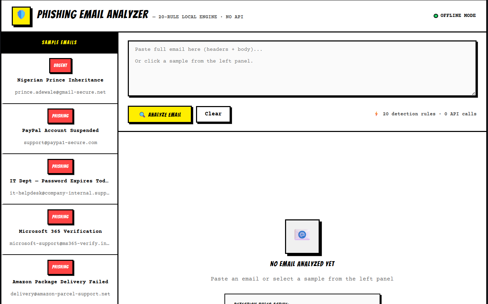
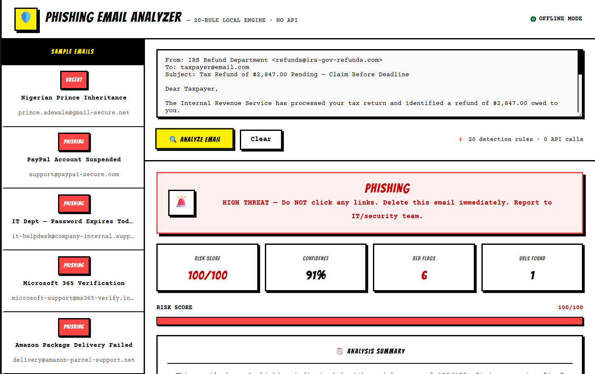
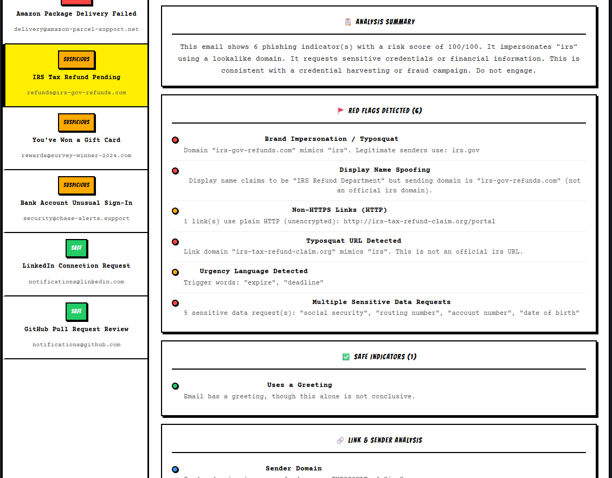
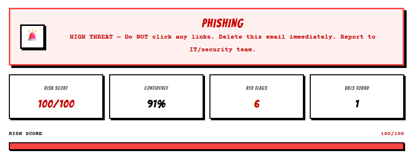

# 📧 Phishing Email Analyzer

> ⚠ Educational Use Only
>
> This project runs entirely inside the browser. No emails, attachments, or user data are transmitted, stored, or sent to external services. Zero API calls — fully offline.

An interactive React-based cybersecurity tool that analyzes email content for phishing indicators using a **20-rule local heuristic engine**. Detects suspicious links, social engineering tactics, credential harvesting attempts, brand impersonation, typosquatting, and other common characteristics of phishing campaigns — with no backend, no API keys, and no internet dependency.

---

# 🌐 Live Demo

https://phishing-analyzer-eta.vercel.app/

---

# 📖 Overview

Phishing emails remain one of the most effective cyberattack methods used to steal credentials, distribute malware, and manipulate users into revealing sensitive information.

This tool allows users to paste email content and receive a detailed analysis highlighting suspicious elements commonly found in phishing campaigns.

The analyzer runs a 20-rule detection engine entirely in the browser, producing instant risk scores, red flag breakdowns, and safe indicator summaries — with no external dependencies.

---

# ✨ Features

### 📧 Email Content Analysis

Analyzes emails for:

- Suspicious and Urgency Language
- Credential Harvesting Attempts
- Fake Login Requests
- Fear-Based and Threat Messaging
- Social Engineering Techniques
- Financial Fraud and Advance Fee Indicators
- Business Email Compromise Patterns
- Impersonation Attempts
- Account Verification Scams
- Generic / Mass-Sending Greeting Patterns

### 🔗 Link Analysis

Detects:

- HTTP (Unencrypted) Links
- IP Address-Based URLs
- Typosquatting Domains
- Deep Subdomain Nesting
- URL Shortener Usage
- Suspicious TLD Extensions (.xyz, .tk, .ru, .top, .click and 15+ more)
- Brand Impersonation in Link Domains

### 🚩 20-Rule Local Detection Engine

| # | Rule | What It Catches |
|---|------|----------------|
| 1 | Sender Domain Validation | Checks against 50+ known legitimate domains |
| 2 | Typosquat / Homograph Detection | `paypa1`, `rn1crosoft`, character substitutions (0→o, 1→l) |
| 3 | Brand Impersonation | Display name spoofing against actual sending domain |
| 4 | Suspicious TLD Detection | `.xyz`, `.tk`, `.ru`, `.top`, `.click`, `.biz` and more |
| 5 | IP-Based URL Detection | Raw IP addresses used as hostnames |
| 6 | URL Shortener Detection | bit.ly, tinyurl, goo.gl, ow.ly and more |
| 7 | Deep Subdomain Nesting | 4+ subdomain levels used to obscure real domain |
| 8 | HTTP vs HTTPS Link Check | Flags unencrypted links |
| 9 | Suspicious TLD Inside Link | Checks link domains independently of sender |
| 10 | Urgency / Pressure Language | 30+ trigger phrases |
| 11 | Threat / Consequence Language | "account frozen", "legal action", "fund seizure" |
| 12 | Reward / Prize Bait | Lottery, inheritance, gift card, business proposal scams |
| 13 | Sensitive Data Request Detection | CVV, SSN, routing number, PIN, passport |
| 14 | Subject Line Manipulation | Excessive CAPS ratio, emoji, multiple exclamation marks |
| 15 | Reply-To Header Mismatch | Replies routed to attacker-controlled domain |
| 16 | Generic Greeting Detection | "Dear Valued Customer" bulk phishing indicator |
| 17 | BCC / Undisclosed Recipients | Mass campaign sending patterns |
| 18 | Advance Fee Request | Small payment traps ("$1.99 redelivery fee") |
| 19 | Content Obfuscation | HTML entity encoding, base64 payload hints |
| 20 | Non-Latin / Cyrillic Homoglyphs | Unicode character spoofing in domains or body text |

### 📊 Risk Scoring

Generates:

- ✅ Legitimate (0–29)
- ⚠️ Suspicious (30–59)
- 🚨 Phishing / High Risk (60–100)

With per-flag severity levels (Danger / Warning / Info) and confidence scoring based on total signal count.

---

# ⚙️ Technology Stack

- React.js
- JavaScript (ES6+)
- HTML5
- CSS3
- React Hooks

### Client-Side Processing

- No Backend Required
- No Database
- No API Keys
- No External Calls
- No Email Storage
- Browser-Only Analysis
- Instant Results (< 1 second)

---

# 🚀 Installation

## Clone Repository

```bash
git clone https://github.com/YOUR_USERNAME/phishing-email-analyzer.git
cd phishing-email-analyzer
```

## Install Dependencies

```bash
npm install
```

## Run Development Server

```bash
npm start
```

## Create Production Build

```bash
npm run build
```

---

# 📸 Screenshots

### Dashboard



### Email Analysis



### Risk Assessment



### Detection Results



---

# 🎓 Example Use Cases

- Cybersecurity Awareness Training
- Phishing Detection Education
- University Security Projects
- Security Awareness Workshops
- Employee Security Training
- Ethical Hacking Demonstrations
- Information Security Coursework

---

# 📂 Project Structure

```text
phishing-email-analyzer/
│
├── public/
│
├── src/
│   ├── App.js
│   ├── index.js
│   └── PhishingAnalyzer.jsx
│
├── screenshots/
│   ├── dashboard.png
│   ├── analysis.png
│   ├── risk-assessment.png
│   └── results.png
│
├── .gitignore
├── LICENSE
├── README.md
├── package.json
└── package-lock.json
```

---

# ⚠ Disclaimer

This project is intended strictly for educational purposes and cybersecurity awareness training.

The analysis provided by this tool is heuristic-based and should not be considered a replacement for enterprise email security solutions or professional threat intelligence services.

Results should be treated as educational guidance rather than definitive security assessments.

The author assumes no responsibility for misuse of this software.

---

# 👨‍💻 Author

**Charuka**

Cybersecurity Student | Information Security Enthusiast

---

# 📄 License

Licensed under the MIT License.

Free to use for educational, academic, and cybersecurity awareness purposes.
